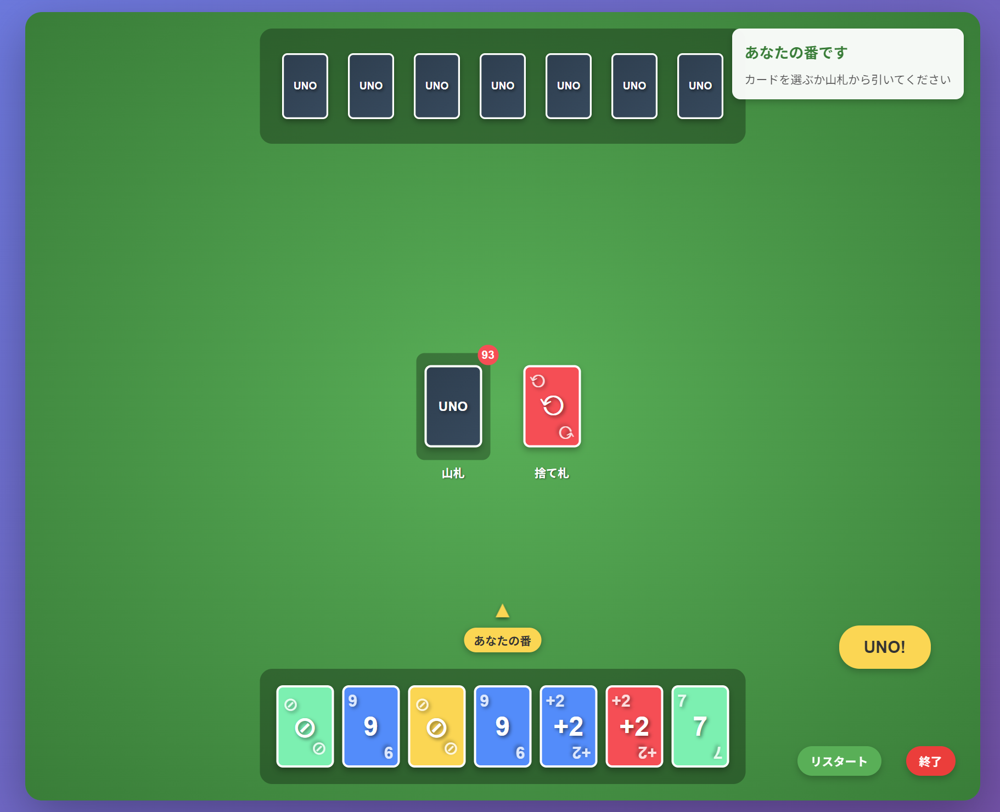

# UNO Game HTML



## 概要

HTMLで作られたシンプルなUNOゲームです。ブラウザ上で手軽に遊べる日本語対応のUNOゲームを提供します。

## 特徴

- 🎮 **シンプルな操作**: ブラウザ上でクリックするだけで遊べます
- 🗾 **日本語対応**: 完全日本語インターフェース
- 🔊 **音声ガイド**: カードの色や数字を音声で読み上げ
- 🎯 **本格的なルール**: UNO宣言、ペナルティ、チャレンジルールを実装
- 📱 **レスポンシブ**: PC・タブレット・スマートフォンに対応

## ゲーム機能

### 基本機能
- プレイヤー vs CPU の1対1対戦
- 標準的なUNOルールに準拠
- カードの色と数字の音声読み上げ
- ゲームの進行状況を音声でガイド

### 特殊カード
- **スキップカード**: 相手のターンをスキップ
- **リバースカード**: ターンの順番を逆転（1対1では実質スキップ）
- **ドロー2カード**: 相手に2枚引かせる
- **ワイルドカード**: 好きな色に変更
- **ワイルドドロー4**: 好きな色に変更＋相手に4枚引かせる

### 高度な機能
- **UNO宣言**: 手札が1枚になったら「UNO」ボタンを押す
- **ペナルティシステム**: UNO宣言を忘れると2枚のペナルティ
- **チャレンジルール**: ワイルドドロー4に対してチャレンジ可能
- **色インジケーター**: ワイルドカードで選択した色を視覚的に表示

## 遊び方

1. ブラウザで `uno-game.html` を開く
2. ゲームが自動的に開始されます
3. 自分のターンで出せるカードをクリック
4. 手札が1枚になったら「UNO」ボタンを押す
5. 手札を全て出し切ったら勝利！

## 操作方法

- **カードを出す**: 出したいカードをクリック
- **UNO宣言**: 手札が1枚の時に「UNO」ボタンをクリック
- **色選択**: ワイルドカード使用時に色を選択
- **チャレンジ**: ワイルドドロー4に対して「チャレンジ」ボタンをクリック
- **リスタート**: 「リスタート」ボタンで新しいゲームを開始
- **終了**: 「終了」ボタンでゲームを終了

## 技術仕様

- **言語**: HTML5, CSS3, JavaScript (ES6+)
- **音声**: Web Speech API (音声合成)
- **対応ブラウザ**: Chrome, Firefox, Safari, Edge
- **依存関係**: なし（単一HTMLファイル）

## インストール・実行方法

### 方法1: 直接実行
1. `uno-game.html` をダウンロード
2. ブラウザで開く

### 方法2: ローカルサーバー
```bash
# Pythonを使用する場合
python -m http.server 8000

# Node.jsを使用する場合
npx http-server
```

その後、ブラウザで `http://localhost:8000/uno-game.html` にアクセス

## ファイル構成

```
uno/
├── uno-game.html    # メインゲームファイル
├── README.md        # このファイル（日本語）
└── README_EN.md     # 英語版README
```

## ライセンス

MIT License

## 作者

GOSAN007

## 貢献

プルリクエストやイシューの報告を歓迎します！

---

**楽しいUNOゲームをお楽しみください！** 🎉